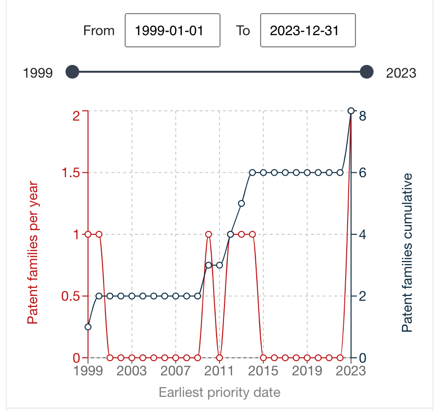
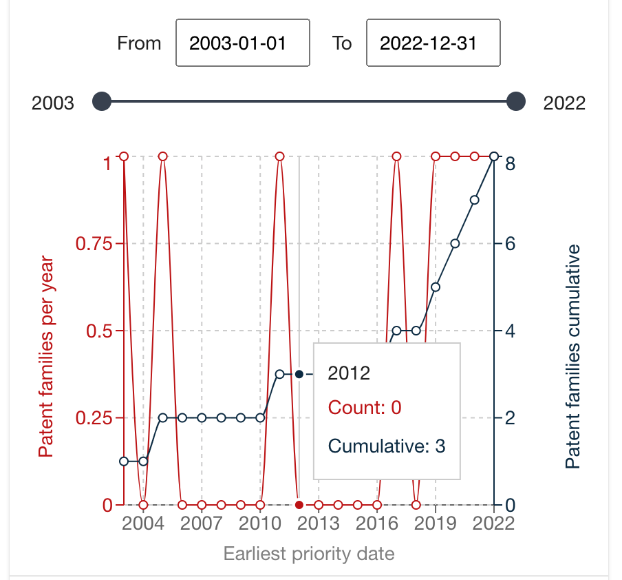
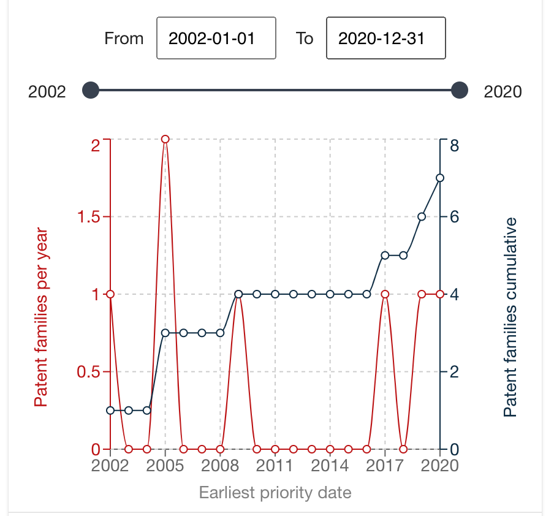

# Atividade

## Legislação sobre Transferência de Tecnologia
[link](https://www.gov.br/agu/pt-br/composicao/procuradoria-geral-federal-1/subprocuradoria-federal-de-consultoria-juridica/camara-permanente-da-ciencia-tecnologia-e-inovacao-1/instrumentos-do-marco-legal-de-ct-i/contratos-que-envolvem-transferencia-de-tecnologia-no-marco-legal-de-ct-i)
## Busque do seu interesse uma empresa especializada em P&D

Eu estou procurando patentes de hardware para controle de acesso de pedestres similar a uma catraca com CPC e06b11/08.

### Nome das empresas com depósito de patentes no Brasil

1. MAGNETIC AUTOCONTROL GMBH (DE)
   - BR 11 2022 001069 9 A2
   - BR 10 2018 073079 7 A2
   - BR 11 2013 021550 0 A2
2. ENTERPLAK PRODUTOS ELETRÔNICOS LTDA.
   - BR 20 2013 027190 5 U2
3. Proveu Indústria Eletrônica LTDA (BR/MG)
   - BR 20 2012 009334 6 U8

Levando em conta o levantamento feito no INPI, a atividade levará em conta como escolha MAGNETIC AUTOCONTROL GMBH como empresa selecionada.

## Quais as 3 atividades tecnológicas mais desenvolvidas pela empresa

- 11 Depósitos de Patente (Cancelas para controle de entrada de veículos)
  - E01F13/00 Arrangements for obstructing or restricting traffic, e.g. gates, barricades (for railway crossings B61L ); Preventing passage of vehicles of selected category or dimensions (E01F13/12, E01F13/126 take precedence)
    E01F13/04 •
    movable to allow or prevent passage (E01F13/12, E01F15/12 take precedence; removing part of barrier for occasional passage E01F13/024; gates for allowing passage through fences E06B11/02)
    E01F13/06 • •
    by swinging into open position about a vertical or horizontal axis parallel to the road direction, i.e. swinging gates
- 10 Depósitos de Patente (Cancelas para controle de pedestres)
  - E06B11/08 Turnstiles; Gates for control of entry or exit of persons, e.g. in supermarkets (control gates on vehicles B60N5/00 ; bank protection devices E05G5/00; with registering means G07C9/10 ; coin-freed facilities for turnstiles G07F17/14)
- 9 Depósitos de Patente (Dispositivos para ponto eletrônico)
  - G07 CHECKING-DEVICES G07C TIME OR ATTENDANCE REGISTERS; REGISTERING OR INDICATING THE WORKING OF MACHINES; GENERATING RANDOM NUMBERS; VOTING OR LOTTERY APPARATUS; ARRANGEMENTS, SYSTEMS OR APPARATUS FOR CHECKING NOT PROVIDED FOR ELSEWHERE G07C9/00 Individual registration on entry or exit

## Mostre a curva de evolução temporal das 3 maiores tecnologias de interesse da empresa

- E01F13/06 - Cancelas para controle de entrada de veículos
  
- E06B11/08 - Cancelas para controle de pedestres
  
- G07C9/00 - Dispositivos para ponto eletrônico
  

## Em quais países essa empresa é mais atuante?

- Alemanha
- Europa
- Brasil

## Se você fosse uma empresa concorrente, quem você contrataria para desenvolver projetos de P&D?

1. BURGIN THOMAS
2. LAIS LOTHAR
3. LAUER THOMAS

## A empresa atua no Brasil?

Sim
